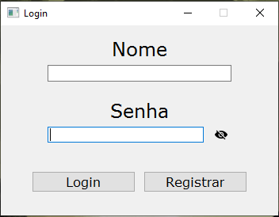
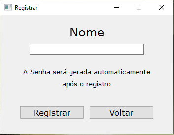
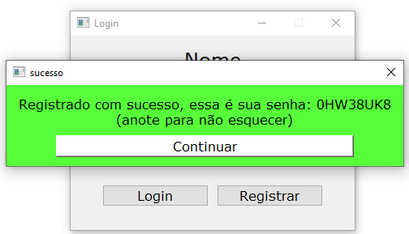
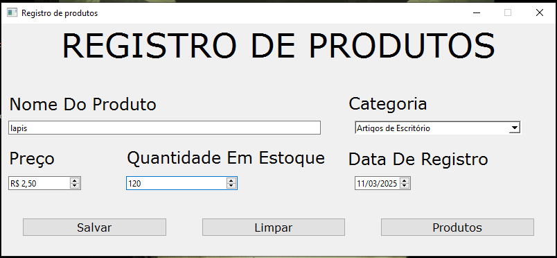
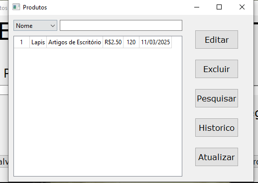
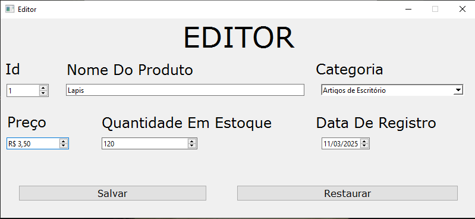
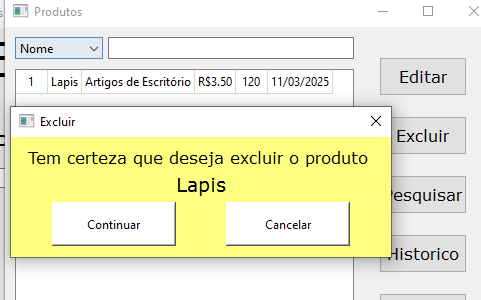
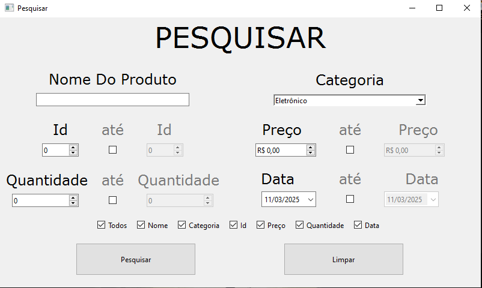
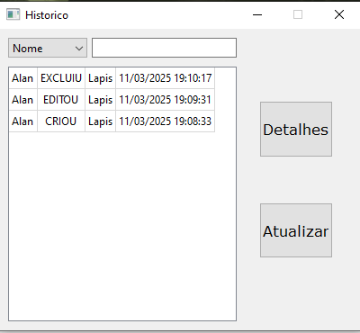
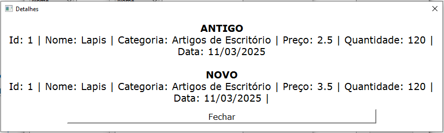

# Registro de Produtos

Um programa completo para gerenciamento de produtos, desenvolvido em Python com interface gráfica PyQt6. O sistema permite o **cadastro**, **edição**, **exclusão** e **pesquisa** de produtos, armazenando todas as informações em um banco de dados local. Além disso, o programa inclui um **histórico de alterações**, que registra todas as mudanças feitas no banco de dados, e uma **tela de login** para identificar qual usuário realizou cada ação.

Com funcionalidades robustas e uma interface intuitiva, o Registro de Produtos é uma solução eficiente para o controle de estoque e gerenciamento de produtos em pequenos e médios negócios.

---

## Sumário

- [Processo de Criação](#processo-de-criação)
- [Ferramentas e Tecnologias](#ferramentas-e-tecnologias)
- [Como Usar](#como-usar)
- [Funcionalidades](#funcionalidades)
- [Contato](#contato)

---

## Processo de Criação

Este projeto é uma **versão aprimorada** de um sistema que desenvolvi durante um curso na Udemy. A ideia original era criar um programa simples para gerenciar produtos em um banco de dados, com funcionalidades básicas de **CRUD** (Create, Read, Update, Delete). No entanto, decidi expandir e melhorar o projeto, adicionando novas funcionalidades e refinando a interface.

### Base do Projeto
Como já tinha conhecimento prévio da estrutura básica do sistema, comecei refazendo e aprimorando o código original. Utilizei o projeto anterior como referência, mas desta vez busquei implementar melhorias significativas, como:
- Um **histórico de alterações** para rastrear mudanças no banco de dados.
- Uma **tela de login** para identificar qual usuário realizou cada ação.
- Uma interface gráfica mais **intuitiva e responsiva**.

### Desafios e Aprendizados
Durante o desenvolvimento, encontrei alguns desafios, especialmente em partes onde meu conhecimento era limitado. Para superar essas dificuldades, utilizei ferramentas de **Inteligência Artificial** (como ChatGPT e DeepSeek) como auxílio. Essas ferramentas me ajudaram a:
- Entender conceitos novos, como o uso avançado do **PyQt6** para criar interfaces gráficas.
- Resolver erros e bugs que não conseguia identificar sozinho.
- Aprender boas práticas de programação e otimização de código.

É importante destacar que **não copiei e colei código**. Usei a IA como uma ferramenta de estudo e consulta, sempre buscando compreender as soluções propostas e aplicá-las de forma consciente no projeto.

### Evolução
Ao longo do processo, pude perceber uma evolução significativa no meu entendimento de Python, PyQt6 e integração com banco de dados. O projeto não só atingiu seu objetivo inicial, mas também se tornou uma **base sólida** para futuras melhorias e expansões.

[Voltar ao Sumário](#sumário)

---

## Ferramentas e Tecnologias

- **Linguagem**: Python 3.12.6
- **Interface Gráfica**: PyQt6
- **Banco de Dados**: MySQL
- **Bibliotecas**:
  - `pymysql`: Para conexão com o banco de dados.
  - `PyInstaller`: Para criar o executável.
- **Ferramentas**:
  - Qt Designer: Para criar as interfaces gráficas.
  - Git: Para controle de versão.

[Voltar ao Sumário](#sumário)

---

## Como Usar

Aqui está um guia passo a passo para usar o programa:

---

### 1. **Tela de Login**
Na tela de login, insira seu nome de usuário e senha. Há dois botões: um para fazer o login e outro para registrar um novo usuário.

---

### 2. **Tela de Registro**
Na tela de registro, insira o nome do usuário. A senha é gerada automaticamente com 8 dígitos, contendo números e letras aleatórias.

---

### 3. **Senha Gerada**
Após clicar no botão de registrar, a senha é gerada e exibida na tela. Anote-a para não esquecer.

---

### 4. **Tela de Registro de Produtos**
Após o login, você será direcionado para a tela de registro de produtos. Aqui você pode cadastrar novos produtos, informando:
- Nome
- Categoria
- Preço
- Quantidade
- Data (o ID é gerado automaticamente).

Há três botões:
- **Salvar**: Salva o produto no banco de dados.
- **Limpar**: Limpa todos os campos.
- **Ver Tabela de Produtos**: Exibe a tabela com os produtos cadastrados.

---

### 5. **Tabela de Produtos**
Na tabela de produtos, você pode visualizar todos os produtos cadastrados. Há opções para:
- **Editar**: Editar um produto existente.
- **Excluir**: Excluir um produto.
- **Pesquisar**: Fazer uma pesquisa avançada.
- **Histórico**: Ver o histórico de alterações.
- **Atualizar**: Atualizar a tabela manualmente.

---

### 6. **Editar Produto**
Na tela de edição, você pode alterar qualquer atributo do produto, incluindo o ID.

---

### 7. **Excluir Produto**
Ao clicar em "Excluir", uma tela de confirmação é exibida, mostrando o nome do produto selecionado. Clique em "Continuar" para confirmar a exclusão.

---

### 8. **Pesquisa Avançada**
Na tela de pesquisa avançada, você pode pesquisar produtos com base em múltiplos atributos, como nome, categoria, preço, quantidade e data. Também é possível pesquisar por intervalos (por exemplo, produtos com preço entre R$ 10 e R$ 50).

---

### 9. **Histórico de Alterações**
No histórico, você pode ver todas as alterações feitas no banco de dados, incluindo:
- Data da alteração.
- Quem realizou a ação.
- Nome do produto afetado.

Há também uma opção para pesquisar no histórico e um botão para ver os detalhes de cada alteração.

---

### 10. **Detalhes do Histórico**
Na tela de detalhes, você pode ver as informações completas de um produto antes e depois de uma edição.

---

### Observações:
- O programa funciona com um banco de dados local (MySQL). Para usá-lo, é necessário configurar o MySQL e executar os comandos SQL fornecidos no arquivo `criar_tabelas.txt`.
- O programa também possui telas de erro para lidar com situações inválidas, mas o foco aqui foi mostrar as funcionalidades principais.

[Voltar ao Sumário](#sumário)

---

## Contato

Se você tiver alguma dúvida, sugestão ou quiser entrar em contato, sinta-se à vontade para me enviar uma mensagem através dos seguintes canais:

- **E-mail**: [seuemail@example.com](Alan.hirokiF@gmail.com)  
- **LinkedIn**: [linkedin.com/in/seu-linkedin](https://www.linkedin.com/in/alan-ferreira-273372353/)  
- **Instagram**: [instagram.com/seu-instagram](https://www.instagram.com/alan_hiroki/)  
